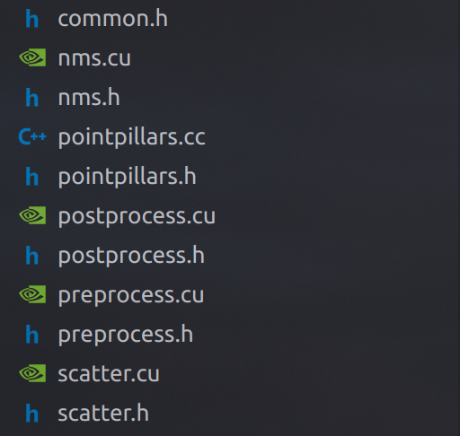

最近在调研和参与一些激光雷达检测算法的部署与研发项目，各种算法项目其实各有优劣，这篇文字主要对[GitHub - hova88/PointPillars_MultiHead_40FPS: A REAL-TIME 3D detection network [Pointpillars] compiled by CUDA/TensorRT/C++.](https://github.com/hova88/PointPillars_MultiHead_40FPS.git) 这个项目进行一些解读。

首先，这个项目是对Multi-head pointpillars的tensorRT的部署实现，部署的方式是比较常见的两阶段，也就是没有把Scatter操作揉进onnx里去，在推理阶段通过实现scatter kernel完成两个模型之间的衔接。

模型的代码部分任然与pointpillars的其他tensorRT部署项目类似，主要分为几个模块：



主要的其实有前处理(preprocess), pillarscatter(scatter), 以及后处理(postprocess)。 

我们先来看前处理部分，预处理部分会将点云的输入转化为输入模型的特征，前处理部分总共由五个阶段的cuda kernel实现，分别是：

- make_pillar_histo_kernel
- make_pillar_index_kernel
- make_pillar_feature_kernel
- pillar_mean_kernel
- gather_point_feature_kernel

**make_pillar_histo_kernel<<num_points/num_threads, num_threads >>** 函数将点云转化为基本的特征图，这个特征图和输入点云的特征点如xyzi或xyzir一致，同时会过滤掉不在范围中的点云。

```cpp
__global__ void make_pillar_histo_kernel(
    const float* dev_points, float* dev_pillar_point_feature_in_coors,
    int* pillar_count_histo, const int num_points,
    const int max_points_per_pillar, const int grid_x_size,
    const int grid_y_size, const int grid_z_size, const float min_x_range,
    const float min_y_range, const float min_z_range, const float pillar_x_size,
    const float pillar_y_size, const float pillar_z_size,
    const int num_point_feature) {
	// input: 输入的点云数据 
	// output: 输出的pillar point
  // output: 输出的pillar count 会在后续make pillar index kernel 中用到
  // params: num_points 输入点云数量
	// params: max_points_per_pillar 每个pillar点云数量
  // params: grid_x_size x grid的尺寸
  // params: grid_y_size y grid的尺寸
  // params: grid_z_size z grid的尺寸
  // params: min_x_range 输入点 x 的范围
  // params: min_y_range 输入点 y 的范围
  // params: min_z_range 输入点 z 的范围
  // params: pillar_x_size pillar x 尺寸
  // params: pillar_y_size pillar y 尺寸
  // params: pillar_z_size pillar z 尺寸

  int th_i = blockIdx.x * blockDim.x +  threadIdx.x ;
  if (th_i >= num_points) {
    return;
  }
  // 计算 xyz 的范围
  int x_coor = floor((dev_points[th_i * num_point_feature + 0] - min_x_range) / pillar_x_size);
  int y_coor = floor((dev_points[th_i * num_point_feature + 1] - min_y_range) / pillar_y_size);
  int z_coor = floor((dev_points[th_i * num_point_feature + 2] - min_z_range) / pillar_z_size);
	
  // 如果coor 在grid size 范围内
  if (x_coor >= 0 && x_coor < grid_x_size && y_coor >= 0 &&
      y_coor < grid_y_size && z_coor >= 0 && z_coor < grid_z_size) {
		// pillar_count_histo 统计每个pillar中点的个数
    int count =
        atomicAdd(&pillar_count_histo[y_coor * grid_x_size + x_coor], 1);
    // 这里使用原子操作的原因是因为保证在并行执行的时候添加的点不会超过max_points_per_pillar
	  **//  y  x_coor ------------ > 
    //  |  [point_per_pillar * num_point_feature] 
		//  c
    //  o
    //  o
    //  r 
		if (count < max_points_per_pillar) {**
      int ind =
          y_coor * grid_x_size * max_points_per_pillar * num_point_feature +
          x_coor * max_points_per_pillar * num_point_feature +
          count * num_point_feature;
 
      for (int i = 0; i < num_point_feature; ++i) {
        dev_pillar_point_feature_in_coors[ind + i] =
            dev_points[th_i * num_point_feature + i];
      }
    }
  }
}
```

**make_pillar_index_kernel <<grid_x, grid_y>>** 我们知道在pointpillar的特征点提取后，会把stack形式的pillar feature映射成CHW的Pseudo Images。这个步骤需要一个输入也就是计算生成pillar feature时的pillar index，make_pillar_index_kernel就是起到这个作用。

```cpp
__global__ void make_pillar_index_kernel(
    int* dev_pillar_count_histo, int* dev_counter, int* dev_pillar_count,
    int* dev_x_coors, int* dev_y_coors, float* dev_num_points_per_pillar,
    int* dev_sparse_pillar_map, const int max_pillars,
    const int max_points_per_pillar, const int grid_x_size,
    const int num_inds_for_scan) {
	// input:  dev_pillar_count_histo 输入的点云数据
  // output: dev_counter 用于计算 kernel 之间的 count 的原子操作变量
  // output: dev_pillar_count 统计 pillar 的数量
  // output: dev_x_coors x 的 index
  // output: dev_y_coors y 的 index
  // output: dev_num_points_per_pillar 每个 pillar 中含有点的数量
  // output: dev_sparse_pillar_map 这个 pillarmap 看上去是像一个洗漱的显示 pillar 是0还是1的图形显示
	// params: max_pillars 最大的pillars数量 40000？类似这样的数值？
  // params: max_points_per_pillar 每个pillar中含有的point数量
  // params: grid_x_size x grid的尺寸
  // params: num_inds_for_scan  Number of indexes for scan 这个和 dev_sparse_pillar_map 有关
  int x = blockIdx.x;
  int y = threadIdx.x;
	// 这里每个block
  int num_points_at_this_pillar = dev_pillar_count_histo[y * grid_x_size + x];
	// 首先判断pillar里面是否包含点
  if (num_points_at_this_pillar == 0) {
    return;
  }

  int count = atomicAdd(dev_counter, 1);
  if (count < max_pillars) {
    atomicAdd(dev_pillar_count, 1);
    if (num_points_at_this_pillar >= max_points_per_pillar) {
      dev_num_points_per_pillar[count] = max_points_per_pillar;
    } else {
      dev_num_points_per_pillar[count] = num_points_at_this_pillar;
    }
    dev_x_coors[count] = x;
    dev_y_coors[count] = y;
    dev_sparse_pillar_map[y * num_inds_for_scan + x] = 1;
  }
}
```

**make_pillar_index_kernel <<pillar count, max_num_per_pillar>>** 将 pillar featrue in coors[grid_y_size_, grid_x_size_, max_num_points_per_pillar_,  num_point_feature_] 转化成 pillar point feature[kMaxNumPillars, kMaxNumPointsPerPillar, kNumPointFeature].

```cpp
__global__ void make_pillar_feature_kernel(
    float* dev_pillar_point_feature_in_coors, float* dev_pillar_point_feature,
    float* dev_pillar_coors, int* dev_x_coors, int* dev_y_coors,
    float* dev_num_points_per_pillar, const int max_points,
    const int num_point_feature, const int grid_x_size) {
	// input: dev_pillar_point_feature_in_coors 输出的pillar point
  // output: dev_pillar_point_feature 输出每个pillar 的特征
  // output: dev_pillar_coors //pillar 的 index [pillar*[batch_idx, z, y, x]]
  // input: dev_x_coors
  // input: dev_y_coors
  // params: dev_num_points_per_pillar
  // params: max_points
  // params: num_point_feature
  // params: grid_x_size
  
  // 第n个pillar  
  int ith_pillar = blockIdx.x; 
  // 这个pillar点的数量
  int num_points_at_this_pillar = dev_num_points_per_pillar[ith_pillar];
  // ith_point 这个点的数量
  int ith_point = threadIdx.x;
  if (ith_point >= num_points_at_this_pillar) {
	  // 因为生成的threadIdx的size是确定的 
    // 而每个pillars里面的点的数量不是固定的，所以要过滤这一部分的操作
    return;
  }
  int x_ind = dev_x_coors[ith_pillar];
  int y_ind = dev_y_coors[ith_pillar];

	// 特征点在pillar map 里的尺寸
  int pillar_ind = ith_pillar * max_points * num_point_feature +
                   ith_point * num_point_feature;
  // 特征点在coors map 里的尺寸
  int coors_ind = y_ind * grid_x_size * max_points * num_point_feature +
                  x_ind * max_points * num_point_feature +
                  ith_point * num_point_feature;
  #pragma unroll 
  for (int i = 0; i < num_point_feature; ++i) {
    dev_pillar_point_feature[pillar_ind + i] =
        dev_pillar_point_feature_in_coors[coors_ind + i];
  }

  float coor_x = static_cast<float>(x_ind);
  float coor_y = static_cast<float>(y_ind);
  dev_pillar_coors[ith_pillar * 4 + 0] = 0;  // batch idx
  dev_pillar_coors[ith_pillar * 4 + 1] = 0;  // z
  dev_pillar_coors[ith_pillar * 4 + 2] = coor_y;
  dev_pillar_coors[ith_pillar * 4 + 3] = coor_x;
}
```

**pillar_mean_kernel** 这个kernel计算pillar均值值

```cpp
__global__ void pillar_mean_kernel(
  float* dev_points_mean, 
  const int num_point_feature,
  const float* dev_pillar_point_feature, 
  const float* dev_num_points_per_pillar, 
  int max_pillars , 
  int max_points_per_pillar) {

    extern __shared__ float temp[];
    int ith_pillar = blockIdx.x; 
    int ith_point  = threadIdx.x;
    int axis = threadIdx.y;
  
    int reduce_size = max_points_per_pillar > 32 ? 64 : 32;
    temp[threadIdx.x * 3 + axis] =  dev_pillar_point_feature[ith_pillar * max_points_per_pillar * num_point_feature + ith_point * num_point_feature + axis];  
    if (threadIdx.x < reduce_size - max_points_per_pillar) {
        temp[(threadIdx.x + max_points_per_pillar) * 3 + axis] = 0.0f; //--> dummy placeholds will set as 0
    }
    __syncthreads();
    int num_points_at_this_pillar = dev_num_points_per_pillar[ith_pillar];

    if (ith_point >= num_points_at_this_pillar) {
          return;
    }

    for (unsigned int d = reduce_size >> 1 ; d > 0.6; d >>= 1) {
        if (ith_point < d) {
            temp[ith_point*3 +axis] += temp[(ith_point + d) * 3 + axis];
        }
        __syncthreads();
    }

    if (ith_point == 0) {
        dev_points_mean[ith_pillar * 3 + axis] = temp[ith_point + axis] / num_points_at_this_pillar ;
    }
}
```

gather_point_feature_kernel 计算pillar 特征点